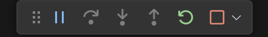

# Como Configurar o PHP Xdebug no Docker para seu ambiente de desenvolvimento

O **Xdebug** é uma ferramenta essencial para depuração em PHP, permitindo que desenvolvedores acompanhem o fluxo de execução do código e identifiquem erros de forma eficiente. Quando usamos o **Docker** para nosso ambiente de desenvolvimento, a configuração do Xdebug pode ser um pouco mais complexa, mas com os passos corretos, conseguimos integrá-lo facilmente a nossa ferramenta de desenvolvimento.

Neste tutorial faremos a configuração para o **Visual Studio Code**.

> **Atenção:** Nunca habilite o xdebug no seu ambiente de produção.

Vou abordar a configuração em 2 cenários comuns (os arquivos dos exemplos estão no repositório [docker-xdebug](https://github.com/oakideas/docker-xdebug)):

1. Configuração para o Apache (1-php-apache-xdebug)
2. Configuração para o Nginx (2-php-nginx-xdebug)

Vamos a prática!

## Criando o ambiente com o Docker

Nesta sessão vamos criar o ambiente com o Docker, você pode escolher entre o Apache ou o Nginx, em seguida vamos configurar o Xdebug no VS Code.

### 1 - Configuração com o Apache (1-php-apache-xdebug)

#### Estrutura de pastas

```
projeto/
├── 1-php-apache-xdebug/
│   ├── docker-compose.yml
│   ├── php/
│   │   ├── Dockerfile
│   │   └── xdebug.ini
│   └── src/
│       └── index.php
```

#### Criando o `php/Dockerfile`

```dockerfile
FROM php:8.2-apache

# MySQL extensions
RUN docker-php-ext-install mysqli pdo pdo_mysql

# install xdebug
RUN pecl install xdebug \
    && docker-php-ext-enable xdebug

EXPOSE 80
```

**Atenção:** Um erro comum na configuração do Xdebug é a export a porta 9003 no container. O xdebug funciona de forma ativa, ele se conectará na porta 9003 da sua IDE (vs code por exemplo) e não o contrário, se você expor a porta 9003 aqui sua IDE não vai conseguir usa-la o xdebug não vai functionar.

#### Criando o `php/xdebug.ini`  

Agora, precisamos configurar o Xdebug criando um arquivo `xdebug.ini`:

```ini
zend_extension=xdebug

[xdebug]
xdebug.mode=develop,debug
xdebug.start_with_request=yes
xdebug.client_host=host.docker.internal
xdebug.client_port=9003
xdebug.log_level=0
xdebug.idekey=VSCODE

```

Nota sobre xdebug.mode: O Xdebug 3 introduziu modos mais granulares. `develop,debug` habilita tanto as funcionalidades de desenvolvimento (como mensagens de erro aprimoradas) quanto a depuração propriamente dita.

#### Criando o `docker-compose.yml`

Agora vamos criar o `docker-compose.yml` com o seguinte conteúdo:

```yaml
services:
  php:
    build:
      context: ./php
      dockerfile: Dockerfile
    container_name: php-container
    volumes:
      - ./src:/var/www/html
      - ./php/xdebug.ini:/usr/local/etc/php/conf.d/xdebug.ini
    environment:
      XDEBUG_MODE: debug
      XDEBUG_CONFIG: "client_host=host.docker.internal client_port=9003 start_with_request=yes"
    extra_hosts:
      - "host.docker.internal:host-gateway"
    ports:
      - "8080:80"
  mysql:
    image: mysql:8.0
    container_name: mysql-container
    environment:
      MYSQL_ROOT_PASSWORD: root
      MYSQL_DATABASE: app_db
    ports:
      - "3306:3306"

```

Note que o arquivo `xdebug.ini` está sendo montado no contêiner PHP, isso é importante para que o Xdebug funcione corretamente. 

Também estamos expondo a porta 9003 do contêiner PHP para a porta 9003 do host. Estamos usando o endereço `host.docker.internal` mapeado em extra_hosts para que o Xdebug se comunique com o VS Code. host.docker.internal é um nome DNS especial que permite que um contêiner Docker acesse o host (máquina onde o Docker está rodando) de forma transparente, quando estamos usando o docker desktop, ele automaticamente cria o alias host-gateway apontando para o IP da máquina host, desta forma mapeamos o host.docker.internal para o host-gateway.

> **Nota para usuários de Linux (instalação nativa do Docker):** Se você não estiver usando o Docker Desktop, a configuração host.docker.internal:host-gateway pode não funcionar. Você pode precisar substituir host-gateway pelo IP da sua interface de rede do Docker (geralmente docker0). Você pode encontrar esse IP usando o comando `ip addr show docker0`. Se o IP for, por exemplo, 172.17.0.1, a configuração seria `extra_hosts: ["host.docker.internal:172.17.0.1"]`. 

> **Nota:** XDEBUG_CONFIG é redundante aqui pois o xdebug.ini já está sendo montado no contêiner PHP. Deixei no exemplo apenas para ilustrar uma forma alternativa de configurar o xdebug.

> **Atenção:** Um erro comum na configuração do Xdebug é a export a porta 9003 no container. O xdebug funciona de forma ativa, ele se conectará na porta 9003 da sua IDE (vs code por exemplo) e não o contrário, se você expor a porta 9003 aqui sua IDE não vai conseguir usa-la o xdebug não vai functionar.

#### Criando um arquivo `src/index.php`

```php
<?php
$dsn = 'mysql:host=mysql;dbname=app_db;charset=utf8mb4';
$username = 'root';
$password = 'root';

try {
    $pdo = new PDO($dsn, $username, $password);
    echo "MySQL connection successful!";
} catch (PDOException $e) {
    echo "Error: " . $e->getMessage();
}

```

#### Rodando o projeto

```sh
docker compose up -d
```

Acesse [http://localhost:8080](http://localhost:8080) para verificar se a conexão foi estabelecida.


### 2 - Configuração com o Nginx (2-php-nginx-xdebug)

#### Estrutura de pastas

```
projeto/
├── 2-php-nginx-xdebug/
│   ├── docker-compose.yml
│   ├── nginx/
│   │   └── nginx.conf
│   ├── php/
│   │   ├── Dockerfile
│   │   └── xdebug.ini
│   └── src/
│       └── index.php
```

#### Criando o `php/Dockerfile`

```dockerfile
FROM php:8.2-fpm

# MySQL extensions
RUN docker-php-ext-install mysqli pdo pdo_mysql

# install xdebug
RUN pecl install xdebug \
    && docker-php-ext-enable xdebug
```

**Atenção:** Um erro comum na configuração do Xdebug é a export a porta 9003 no container. O xdebug funciona de forma ativa, ele se conectará na porta 9003 da sua IDE (vs code por exemplo) e não o contrário, se você expor a porta 9003 aqui sua IDE não vai conseguir usa-la o xdebug não vai functionar.

#### Criando o `php/xdebug.ini`  

Agora, precisamos configurar o Xdebug criando um arquivo `xdebug.ini`:

```ini
zend_extension=xdebug

[xdebug]
xdebug.mode=develop,debug
xdebug.start_with_request=yes
xdebug.client_host=host.docker.internal
xdebug.client_port=9003
xdebug.log_level=0
xdebug.idekey=VSCODE

```

Nota sobre xdebug.mode: O Xdebug 3 introduziu modos mais granulares. `develop,debug` habilita tanto as funcionalidades de desenvolvimento (como mensagens de erro aprimoradas) quanto a depuração propriamente dita.

#### Criando o `nginx/nginx.conf`

Agora vamos criar o `nginx/nginx.conf` com o seguinte conteúdo:

```nginx
server {
    listen 80;
    server_name localhost;
    root /var/www/html;

    index index.php index.html;

    location / {
        try_files $uri $uri/ =404;
    }

    location ~ \.php$ {
        include fastcgi_params;
        fastcgi_pass php:9000;
        fastcgi_index index.php;
        fastcgi_param SCRIPT_FILENAME $document_root$fastcgi_script_name;
    }
}
```

#### Criando o `docker-compose.yml`

Agora vamos criar o `docker-compose.yml` com o seguinte conteúdo:

```yaml
services:
  php:
    build:
      context: ./php
      dockerfile: Dockerfile
    container_name: php-container
    volumes:
      - ./src:/var/www/html
      - ./php/xdebug.ini:/usr/local/etc/php/conf.d/xdebug.ini
    environment:
      XDEBUG_MODE: debug
      XDEBUG_CONFIG: "client_host=host.docker.internal client_port=9003 start_with_request=yes"
    extra_hosts:
      - "host.docker.internal:host-gateway"
  nginx:
    image: nginx:latest
    container_name: nginx-container
    volumes:
      - ./src:/var/www/html
      - ./nginx/default.conf:/etc/nginx/conf.d/default.conf
    ports:
      - "8080:80"
    depends_on:
      - php
  mysql:
    image: mysql:8.0
    container_name: mysql-container
    environment:
      MYSQL_ROOT_PASSWORD: root
      MYSQL_DATABASE: app_db
    ports:
      - "3306:3306"

```

Note que o arquivo `xdebug.ini` está sendo montado no contêiner PHP, isso é importante para que o Xdebug funcione corretamente. 

Também estamos expondo a porta 9003 do contêiner PHP para a porta 9003 do host. Estamos usando o endereço `host.docker.internal` mapeado em extra_hosts para que o Xdebug se comunique com o VS Code. host.docker.internal é um nome DNS especial que permite que um contêiner Docker acesse o host (máquina onde o Docker está rodando) de forma transparente, quando estamos usando o docker desktop, ele automaticamente cria o alias host-gateway apontando para o IP da máquina host, desta forma mapeamos o host.docker.internal para o host-gateway.

> **Nota para usuários de Linux (instalação nativa do Docker):** Se você não estiver usando o Docker Desktop, a configuração host.docker.internal:host-gateway pode não funcionar. Você pode precisar substituir host-gateway pelo IP da sua interface de rede do Docker (geralmente docker0). Você pode encontrar esse IP usando o comando `ip addr show docker0`. Se o IP for, por exemplo, 172.17.0.1, a configuração seria `extra_hosts: ["host.docker.internal:172.17.0.1"]`.

> **Nota:** XDEBUG_CONFIG é redundante aqui pois o xdebug.ini já está sendo montado no contêiner PHP. Deixei no exemplo apenas para ilustrar uma forma alternativa de configurar o xdebug.

> **Atenção:** Um erro comum na configuração do Xdebug é a export a porta 9003 no container. O xdebug funciona de forma ativa, ele se conectará na porta 9003 da sua IDE (vs code por exemplo) e não o contrário, se você expor a porta 9003 aqui sua IDE não vai conseguir usa-la o xdebug não vai functionar.

#### Criando um arquivo `src/index.php`

```php
<?php
$dsn = 'mysql:host=mysql;dbname=app_db;charset=utf8mb4';
$username = 'root';
$password = 'root';

try {
    $pdo = new PDO($dsn, $username, $password);
    echo "MySQL connection successful!";
} catch (PDOException $e) {
    echo "Error: " . $e->getMessage();
}

```

#### Rodando o projeto

```sh
docker compose up -d
```

Acesse [http://localhost:8080](http://localhost:8080) para verificar se a conexão foi estabelecida.


## Configurando o Visual Studio Code  

Agora que o Docker está configurado e rodando (seja com o Apache ou o Nginx), precisamos ajustar o VS Code para escutar as conexões do Xdebug.

### Instalando a Extensão do Xdebug  

No VS Code, vá até a aba de **Extensões** (`Ctrl + Shift + X` ou `Cmd + Shift + X` no MacOS) e instale a extensão **PHP Debug** desenvolvida por Xdebug (xdebug.org)

### Configurando o `launch.json`  

Agora, vamos criar um arquivo `.vscode/launch.json` dentro do projeto:

```json
{
  "version": "0.2.0",
  "configurations": [
    {
      "name": "Listen for Xdebug",
      "type": "php",
      "request": "launch",
      "port": 9003,
      "pathMappings": {
        "/var/www/html": "${workspaceFolder}/src"
      },
      "log": true
    }
  ]
}
  
```

Esse arquivo define um mapeamento de caminho entre o contêiner Docker (`/var/www/html`) e o diretório do projeto no seu computador (`${workspaceFolder}/src`). Atenção aqui, a variavel `${workspaceFolder}` é a pasta do projeto no seu computador, aquela aberta no VS Code. 

Nota: Se você fez checkout do repositório de exemplos (https://github.com/oakideas/docker-xdebug) e abriu a pasta raiz deste repositório no vscode, vai notar que tem uma pasta .vscode extra na raiz do repositório com uma configuração de mapeamento um pouco diferente, o path nesta está configurado como `${workspaceFolder}/1-php-apache-xdebug/src`, e só vai funcionar no exemplo 1, vc precisará alterar manualmente o path para `${workspaceFolder}/2-php-nginx-xdebug/src` para testar com o exemplo 2.

só para deixar mais claro, se esta for sua estrutura de pastas for como o exemplo abaixo:
```
projeto/
├── .vscode/
│   └── launch.json
├── 1-php-apache-xdebug/
│   ├── docker-compose.yml
│   ├── php/
│   │   ├── Dockerfile
│   │   └── xdebug.ini
│   └── src/
│       └── index.php
```

o mapeamento será:
```json
"/var/www/html": "${workspaceFolder}/src"
```

Se sua estrutura de pastas for como o exemplo abaixo:
```
projeto/
├── .vscode/
│   └── launch.json
├── docker-compose.yml
├── php/
│   ├── Dockerfile
│   └── xdebug.ini
└── index.php
```

o mapeamento será:
```json
"/var/www/html": "${workspaceFolder}"
```


## Testando tudo junto, vamos a Depuração  

Agora que tudo está configurado, siga esses passos para testar:

1. **Inicie o Docker**  
   Rode o comando:
   ```sh
   docker-compose up -d
   ```

2. **Coloque um Breakpoint**  
   No VS Code, abra um arquivo PHP e adicione um breakpoint (clicando na margem esquerda).

   

3. **Inicie o Debug**  
   Vá para a aba de **Execução e Depuração** (`Ctrl + Shift + D` ou `Cmd + Shift + D` no MacOS) e clique em **Listen for Xdebug**.

   

   

   Note que o nome da configuração 'Listen for Xdebug' foi definido no `launch.json` como `name: "Listen for Xdebug"`.

4. **Acesse a Aplicação**  
   No navegador, acesse `http://localhost:8080`. O VS Code deve parar no breakpoint.

   

5. **Hora de Depurar**

  

Pronto, agora o `echo` e `var_dump` não são mais únicas ferramentas para ver o que está acontecendo :)
Usar o Xdebug permite que você possa depurar seu código PHP de maneira eficiente, você pode ver o que está acontecendo em tempo real, identificar erros rapidamente e otimizar seu fluxo de desenvolvimento.

## Conclusão  

Com essa configuração, o Xdebug está funcionando dentro do Docker e se comunicando corretamente com o VS Code. Agora, você pode depurar seu código PHP de maneira eficiente, identificando erros rapidamente, inspecionando variáveis, avaliando expressões e otimizando seu fluxo de desenvolvimento.

Espero que este tutorial tenha sido útil para você. Se tiver alguma dúvida ou sugestão, sinta-se à vontade para comentar ou [entrar em contato comigo](https://www.linkedin.com/in/fcsil/).

Siga-me no LinkedIn: [www.linkedin.com/comm/mynetwork/discovery-see-all?usecase=PEOPLE_FOLLOWS&followMember=fcsil](https://www.linkedin.com/comm/mynetwork/discovery-see-all?usecase=PEOPLE_FOLLOWS&followMember=fcsil)


