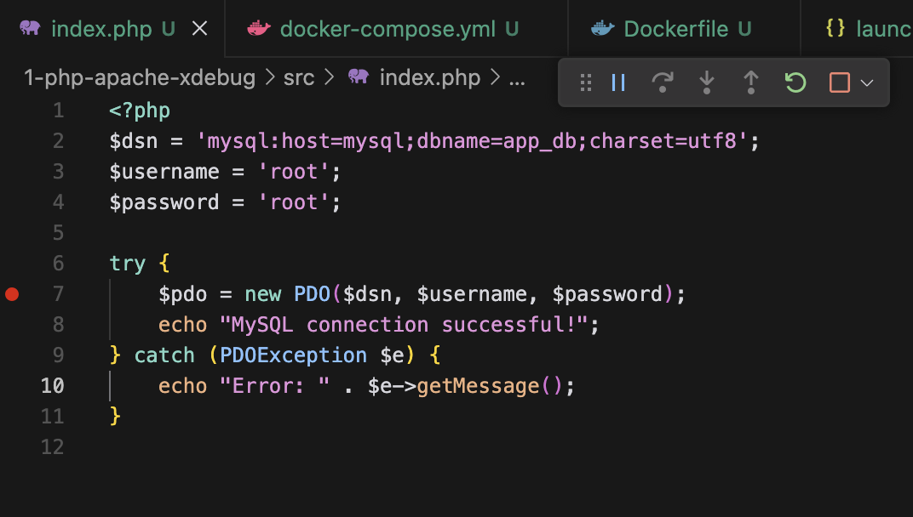
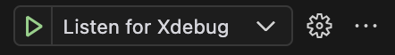
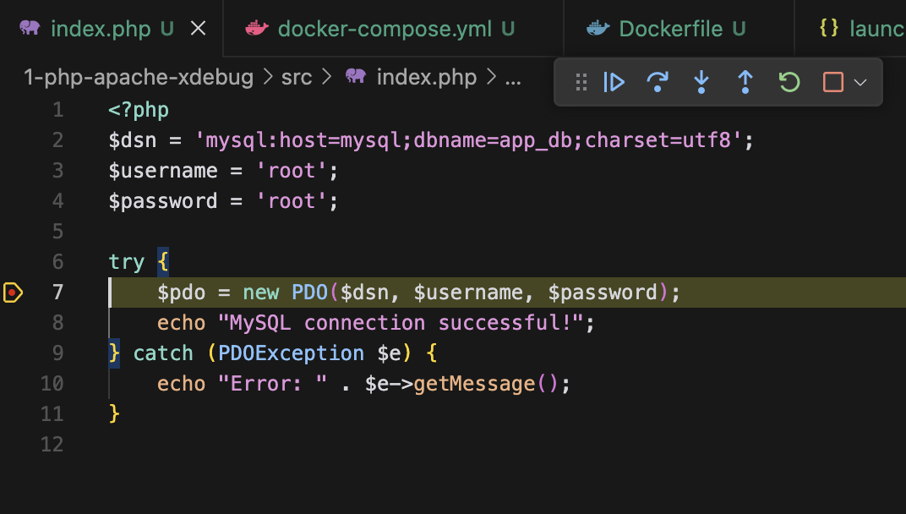

# How to Set Up PHP Xdebug in Docker for Your Development Environment

Em pt-br: [Como Configurar o PHP Xdebug no Docker para seu ambiente de desenvolvimento](./Como%20Configurar%20o%20PHP%20Xdebug%20no%20Docker%20para%20seu%20ambiente%20de%20desenvolvimento.md)

**Xdebug** is an essential tool for debugging in PHP, allowing developers to track the execution flow of the code and identify errors efficiently. When using **Docker** for our development environment, setting up Xdebug can be a bit more complex, but with the right steps, we can easily integrate it into our development tool.

In this tutorial, we will configure it for **Visual Studio Code**.

> **Attention:** Never enable Xdebug in your production environment.

I will cover the setup in 2 common scenarios (the example files are in the [docker-xdebug](https://github.com/oakideas/docker-xdebug) repository):

1.  Setup for Apache (1-php-apache-xdebug)
2.  Setup for Nginx (2-php-nginx-xdebug)

Let's get to it!

## Creating the Environment with Docker

In this session, we will create the environment with Docker. You can choose between Apache or Nginx, and then we will configure Xdebug in VS Code.

### 1 - Setup with Apache (1-php-apache-xdebug)

#### Folder Structure

```
project/
├── 1-php-apache-xdebug/
│   ├── docker-compose.yml
│   ├── php/
│   │   ├── Dockerfile
│   │   └── xdebug.ini
│   └── src/
│       └── index.php
```

#### Creating `php/Dockerfile`

```dockerfile
FROM php:8.2-apache

# MySQL extensions
RUN docker-php-ext-install mysqli pdo pdo_mysql

# install xdebug
RUN pecl install xdebug \
    && docker-php-ext-enable xdebug

EXPOSE 80
```

**Attention:** A common mistake in Xdebug configuration is exposing port 9003 in the container. Xdebug works actively; it will connect to port 9003 of your IDE (VS Code, for example) and not the other way around. If you expose port 9003 here, your IDE won't be able to use it, and Xdebug won't function.

#### Creating `php/xdebug.ini`

Now, we need to configure Xdebug by creating an `xdebug.ini` file:

```ini
zend_extension=xdebug

[xdebug]
xdebug.mode=develop,debug
xdebug.start_with_request=yes
xdebug.client_host=host.docker.internal
xdebug.client_port=9003
xdebug.log_level=0
xdebug.idekey=VSCODE

```

Note about xdebug.mode: Xdebug 3 introduced more granular modes. `develop,debug` enables both development features (like enhanced error messages) and debugging itself.

#### Creating `docker-compose.yml`

Now let's create the `docker-compose.yml` with the following content:

```yaml
services:
  php:
    build:
      context: ./php
      dockerfile: Dockerfile
    container_name: php-container
    volumes:
      - ./src:/var/www/html
      - ./php/xdebug.ini:/usr/local/etc/php/conf.d/xdebug.ini
    environment:
      XDEBUG_MODE: debug
      XDEBUG_CONFIG: "client_host=host.docker.internal client_port=9003 start_with_request=yes"
    extra_hosts:
      - "host.docker.internal:host-gateway"
    ports:
      - "8080:80"
  mysql:
    image: mysql:8.0
    container_name: mysql-container
    environment:
      MYSQL_ROOT_PASSWORD: root
      MYSQL_DATABASE: app_db
    ports:
      - "3306:3306"

```

Note that the `xdebug.ini` file is being mounted in the PHP container; this is important for Xdebug to work correctly.

We are also exposing port 9003 from the PHP container to port 9003 on the host. We are using the `host.docker.internal` address mapped in extra_hosts for Xdebug to communicate with VS Code. host.docker.internal is a special DNS name that allows a Docker container to access the host (the machine where Docker is running) transparently. When using Docker Desktop, it automatically creates the alias host-gateway pointing to the host machine's IP; this way, we map host.docker.internal to host-gateway.

> **Note for Linux users (native Docker installation):** If you are not using Docker Desktop, the `host.docker.internal:host-gateway` configuration may not work. You may need to replace `host-gateway` with the IP of your Docker network interface (usually `docker0`). You can find this IP using the command `ip addr show docker0`. If the IP is, for example, 172.17.0.1, the configuration would be `extra_hosts: ["host.docker.internal:172.17.0.1"]`.

> **Note:** `XDEBUG_CONFIG` is redundant here as `xdebug.ini` is already being mounted in the PHP container. I left it in the example just to illustrate an alternative way to configure Xdebug.

> **Attention:** A common mistake in Xdebug configuration is exposing port 9003 in the container. Xdebug works actively; it will connect to port 9003 of your IDE (VS Code, for example) and not the other way around. If you expose port 9003 here, your IDE won't be able to use it, and Xdebug won't function.

#### Creating a `src/index.php` file

```php
<?php
$dsn = 'mysql:host=mysql;dbname=app_db;charset=utf8mb4';
$username = 'root';
$password = 'root';

try {
    $pdo = new PDO($dsn, $username, $password);
    echo "MySQL connection successful!";
} catch (PDOException $e) {
    echo "Error: " . $e->getMessage();
}

```

#### Running the Project

```sh
docker compose up -d
```

Access [http://localhost:8080](http://localhost:8080) to verify that the connection was established.


### 2 - Setup with Nginx (2-php-nginx-xdebug)

#### Folder Structure

```
project/
├── 2-php-nginx-xdebug/
│   ├── docker-compose.yml
│   ├── nginx/
│   │   └── nginx.conf
│   ├── php/
│   │   ├── Dockerfile
│   │   └── xdebug.ini
│   └── src/
│       └── index.php
```

#### Creating `php/Dockerfile`

```dockerfile
FROM php:8.2-fpm

# MySQL extensions
RUN docker-php-ext-install mysqli pdo pdo_mysql

# install xdebug
RUN pecl install xdebug \
    && docker-php-ext-enable xdebug
```

**Attention:** A common mistake in the configuration of the Xdebug is to export port 9003 in the container.  Xdebug works actively, it will connect to the port 9003 on your IDE (vs code for example) and not the other way around, if you export port 9003 here you IDE will not be able to use it and xdebug will not work.

#### Creating `php/xdebug.ini`

Now, we need to configure Xdebug by creating an `xdebug.ini` file:

```ini
zend_extension=xdebug

[xdebug]
xdebug.mode=develop,debug
xdebug.start_with_request=yes
xdebug.client_host=host.docker.internal
xdebug.client_port=9003
xdebug.log_level=0
xdebug.idekey=VSCODE

```

Note about xdebug.mode: Xdebug 3 introduced more granular modes. `develop,debug` enables both development features (like enhanced error messages) and debugging itself.

#### Creating `nginx/nginx.conf`

Now let's create the `nginx/nginx.conf` with the following content:

```nginx
server {
    listen 80;
    server_name localhost;
    root /var/www/html;

    index index.php index.html;

    location / {
        try_files $uri $uri/ =404;
    }

    location ~ \.php$ {
        include fastcgi_params;
        fastcgi_pass php:9000;
        fastcgi_index index.php;
        fastcgi_param SCRIPT_FILENAME $document_root$fastcgi_script_name;
    }
}
```

#### Creating `docker-compose.yml`

Now let's create the `docker-compose.yml` with the following content:

```yaml
services:
  php:
    build:
      context: ./php
      dockerfile: Dockerfile
    container_name: php-container
    volumes:
      - ./src:/var/www/html
      - ./php/xdebug.ini:/usr/local/etc/php/conf.d/xdebug.ini
    environment:
      XDEBUG_MODE: debug
      XDEBUG_CONFIG: "client_host=host.docker.internal client_port=9003 start_with_request=yes"
    extra_hosts:
      - "host.docker.internal:host-gateway"
  nginx:
    image: nginx:latest
    container_name: nginx-container
    volumes:
      - ./src:/var/www/html
      - ./nginx/nginx.conf:/etc/nginx/conf.d/default.conf
    ports:
      - "8080:80"
    depends_on:
      - php
  mysql:
    image: mysql:8.0
    container_name: mysql-container
    environment:
      MYSQL_ROOT_PASSWORD: root
      MYSQL_DATABASE: app_db
    ports:
      - "3306:3306"

```

Note that the `xdebug.ini` file is being mounted in the PHP container; this is important for Xdebug to work correctly. 

We are also exposing port 9003 from the PHP container to port 9003 on the host. We are using the `host.docker.internal` address mapped in extra_hosts for Xdebug to communicate with VS Code. host.docker.internal is a special DNS name that allows a Docker container to access the host (the machine where Docker is running) transparently. When using Docker Desktop, it automatically creates the alias host-gateway pointing to the host machine's IP; this way, we map host.docker.internal to host-gateway.

> **Note for Linux users (native Docker installation):** If you are not using Docker Desktop, the `host.docker.internal:host-gateway` configuration may not work. You may need to replace `host-gateway` with the IP of your Docker network interface (usually `docker0`). You can find this IP using the command `ip addr show docker0`. If the IP is, for example, 172.17.0.1, the configuration would be `extra_hosts: ["host.docker.internal:172.17.0.1"]`.

> **Note:** `XDEBUG_CONFIG` is redundant here as `xdebug.ini` is already being mounted in the PHP container. I left it in the example just to illustrate an alternative way to configure Xdebug.

> **Attention:** A common mistake in Xdebug configuration is exposing port 9003 in the container. Xdebug works actively; it will connect to port 9003 of your IDE (VS Code, for example) and not the other way around. If you expose port 9003 here, your IDE won't be able to use it, and Xdebug won't function.

#### Creating a `src/index.php` file

```php
<?php
$dsn = 'mysql:host=mysql;dbname=app_db;charset=utf8mb4';
$username = 'root';
$password = 'root';

try {
    $pdo = new PDO($dsn, $username, $password);
    echo "MySQL connection successful!";
} catch (PDOException $e) {
    echo "Error: " . $e->getMessage();
}

```

#### Running the Project

```sh
docker compose up -d
```

Access [http://localhost:8080](http://localhost:8080) to verify that the connection was established.


## Configuring Visual Studio Code

Now that Docker is configured and running (either with Apache or Nginx), we need to adjust VS Code to listen for Xdebug connections.

### Installing the Xdebug Extension

In VS Code, go to the **Extensions** tab (`Ctrl + Shift + X` or `Cmd + Shift + X` on MacOS) and install the **PHP Debug** extension developed by Xdebug (xdebug.org).

### Configuring `launch.json`

Now, let's create a `.vscode/launch.json` file inside the project:

```json
{
  "version": "0.2.0",
  "configurations": [
    {
      "name": "Listen for Xdebug",
      "type": "php",
      "request": "launch",
      "port": 9003,
      "pathMappings": {
        "/var/www/html": "${workspaceFolder}/src"
      },
      "log": true
    }
  ]
}

```

This file defines a path mapping between the Docker container (`/var/www/html`) and the project directory on your computer (`${workspaceFolder}/src`).  Pay attention here, the `${workspaceFolder}` variable is the project folder on your computer, the one opened in VS Code.

Note: If you checked out the example repository (https://github.com/oakideas/docker-xdebug) and opened the root folder of this repository in VS Code, you'll notice that there is an extra .vscode folder in the repository root with a slightly different mapping configuration. The path in this configuration is set as `${workspaceFolder}/1-php-apache-xdebug/src`, and it will only work in example 1. You will need to manually change the path to `${workspaceFolder}/2-php-nginx-xdebug/src` to test with example 2.

just to make it clearer, if this is your folder structure is like the example below:
```
project/
├── .vscode/
│   └── launch.json
├── 1-php-apache-xdebug/
│   ├── docker-compose.yml
│   ├── php/
│   │   ├── Dockerfile
│   │   └── xdebug.ini
│   └── src/
│       └── index.php
```
the mapping will be:
```json
"/var/www/html": "${workspaceFolder}/src"
```

If you folder structure is like the example below:
```
project/
├── .vscode/
│   └── launch.json
├── docker-compose.yml
├── php/
│   ├── Dockerfile
│   └── xdebug.ini
└── index.php
```

the mapping will be:
```json
"/var/www/html": "${workspaceFolder}"
```

## Testing Everything Together, Let's Debug

Now that everything is configured, follow these steps to test:

1.  **Start Docker**
    Run the command:
    ```sh
    docker-compose up -d
    ```

2.  **Set a Breakpoint**
    In VS Code, open a PHP file and add a breakpoint (by clicking on the left margin).

    

3.  **Start Debugging**
    Go to the **Run and Debug** tab (`Ctrl + Shift + D` or `Cmd + Shift + D` on MacOS) and click on **Listen for Xdebug**.

    

    

    Note that the configuration name 'Listen for Xdebug' was defined in `launch.json` as `name: "Listen for Xdebug"`.

4.  **Access the Application**
    In the browser, access `http://localhost:8080`. VS Code should stop at the breakpoint.

    

5.  **Time to Debug**

    

That's it, now `echo` and `var_dump` are no longer the only tools to see what's happening :) Using Xdebug allows you to debug your PHP code efficiently; you can see what's happening in real time, quickly identify errors, and optimize your development workflow.

## Conclusion

With this configuration, Xdebug is working inside Docker and communicating correctly with VS Code. Now, you can debug your PHP code efficiently, quickly identifying errors, inspecting variables, evaluating expressions, and optimizing your development workflow.

I hope this tutorial was helpful to you. If you have any questions or suggestions, feel free to comment or [contact me](https://www.linkedin.com/in/fcsil/).

Follow me on LinkedIn: [www.linkedin.com/comm/mynetwork/discovery-see-all?usecase=PEOPLE_FOLLOWS&followMember=fcsil](https://www.linkedin.com/comm/mynetwork/discovery-see-all?usecase=PEOPLE_FOLLOWS&followMember=fcsil)

